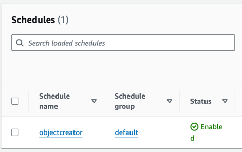
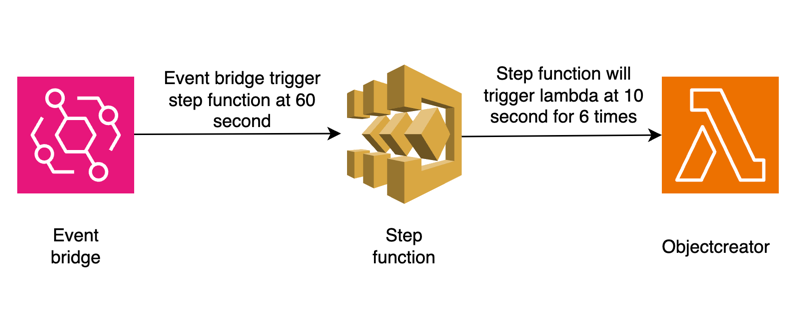

## Architectural block for object creator

### To generate the arm 64 binary

```
GOOS=linux GOARCH=amd64 CGO_ENABLED=0 go build -o main main.go
```
### To make the zip file
```
zip main.zip ./main
```
### GET object

```
curl --location 'https://jp1pqmyhn9.execute-api.eu-central-1.amazonaws.com/dev/34ce89b2-92c6-47ce-8b71-d3f0f31bd2b0'
```
### Response

### POST object
``` 
curl --location 'https://jp1pqmyhn9.execute-api.eu-central-1.amazonaws.com/dev/' \
--header 'Content-Type: text/plain' \
--data 'yagnik'
```
### Response


### Objects in S3


### API gateway configurations


#### Objectcreatorhandler

Referances

- https://stackoverflow.com/questions/54353860/publish-message-to-sns-with-aws-go-sdk
- https://github.com/awslabs/aws-lambda-go-api-proxy/blob/master/gin/adapter.go

